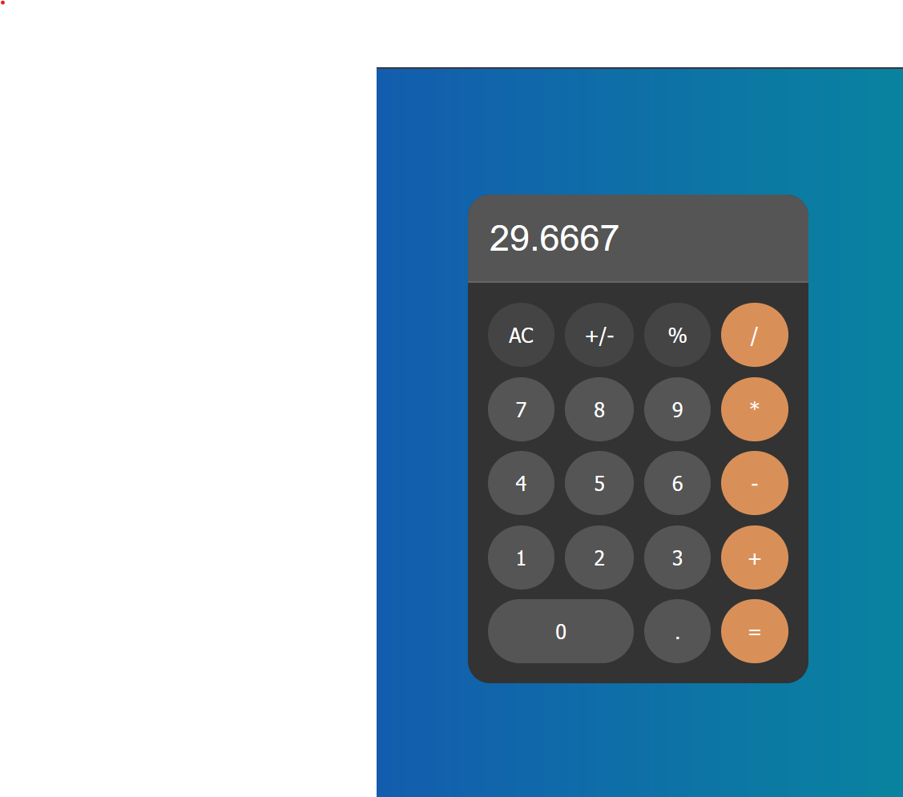

# ماشین حساب ساده - Simple Calculator

div align="center">
  

یک ماشین حساب ساده و کاربردی که با HTML، CSS و JavaScript ساخته شده است. این پروژه دارای رابط کاربری زیبا و عملکرد کامل برای انجام محاسبات پایه است.

## ویژگی‌ها

- **عملیات پایه**: جمع، تفریق، ضرب و تقسیم
- **عملیات اضافی**: 
  - AC (پاک کردن همه)
  - +/- (تغییر علامت)
  - % (درصد)
- **طراحی مدرن**: استفاده از رنگ‌های ایرانی و انیمیشن‌های smooth
- **واکنش‌گرا**: دکمه‌ها دارای انیمیشن کلیک و تغییر رنگ
- **رابط کاربری ساده**: طراحی minimalist و کاربرپسند

## ساختار فایل‌ها

calculator/
├── index.html # ساختار HTML
├── style.css # استایل‌ها و طراحی
├── script.js # منطق برنامه و عملکردها
└── preview.png # تصویر پیش‌نمایش

text

## نصب و اجرا

### روش اول: دانلود مستقیم
1. فایل‌های پروژه را دانلود کنید
2. تمام فایل‌ها را در یک پوشه قرار دهید
3. فایل `index.html` را در مرورگر باز کنید

### روش دوم: استفاده از Git

کلون کردن repository

git clone https://github.com/hamidreza-83/calculator.git
وارد شدن به پوشه پروژه

cd calculator
باز کردن در مرورگر
فایل index.html را دابل کلیک کنید یا در مرورگر باز کنید

text

### روش سوم: استفاده از Live Server
اگر Visual Studio Code دارید:
1. فایل‌ها را در VS Code باز کنید
2. افزونه Live Server را نصب کنید
3. روی `index.html` کلیک راست کرده و "Open with Live Server" را انتخاب کنید

## پیش‌نیازها

- تنها به یک مرورگر مدرن نیاز دارید (Chrome، Firefox، Safari، Edge)
- کار روی تمام سیستم عامل‌ها (Windows، Mac، Linux)

## ساختار کد

### HTML Structure
صفحه شامل یک calculator container با:
- نمایشگر (display) برای نشان دادن اعداد
- شبکه دکمه‌ها (4×5) برای ورودی

### CSS Styling  
برای بک‌گراند از رنگ‌های ایرانی استفاده شده:
- **رنگ اصلی**: `#1c39bb` (آبی)
- **رنگ ثانویه**: `#00a693` (سبز آبی)
- **دکمه‌های دایره‌ای**: با انیمیشن hover و active
- **رنگ‌بندی متمایز**: دکمه‌های عملگر نارنجی، کنترل خاکستری

### JavaScript Logic
- **مدیریت state**: ذخیره ورودی فعلی، قبلی و عملگر
- **event handling**: استفاده از event delegation برای دکمه‌ها  
- **محاسبات**: تابع execute برای انجام عملیات ریاضی
- **validation**: بررسی ورودی‌های معتبر قبل از محاسبه

## توسعه بیشتر

می‌توانید این ماشین حساب را با ویژگی‌های زیر بهبود دهید:
- اضافه کردن عملیات پیشرفته (توان، رادیکال، مثلثات)
- تاریخچه محاسبات
- تم‌های مختلف رنگی

